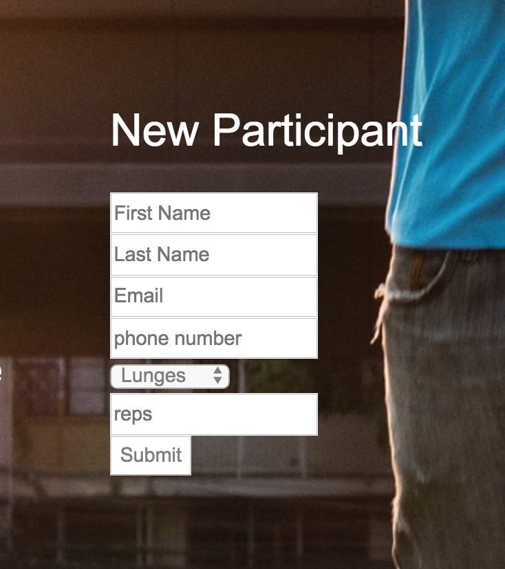
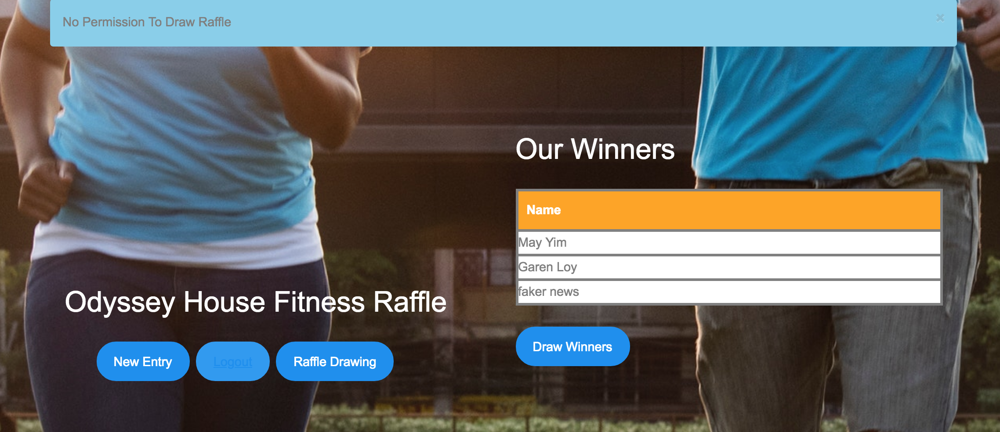

# Odyssey Raffle App

This is a Rails app that allows users to create raffle entries and admin level users to draw raffle winners. The user model is generated and handled by **devise** and styling utlizes **bootstrap**

Submitting Raffle form creates a new instance of RaffleEntry which can be validated for uniqueness when running the drawing function (in this case, one applicant can submit more than once since they are allowed to participate as many times as possible).

Raffle winners are randomly selected by changing the the **:winner** attribute(boolean) of a RaffleEntry to
**true**

Winners table will show contact information only if user has master permission.

### Master View

### Typical View

## Update Pipeline

- Allow users to create, name, and apply their own raffles

- Allow users to set number of raffle Winners

- Allow users to set criteria/filter for raffle winners

- Set up mailer to allow user to contact winners about results and their prizes
